# TechnoMobileProject

## Overview
A comprehensive platform providing robust administrative and customer functionalities for managing mobile technology products.

## Pages

### Login Page
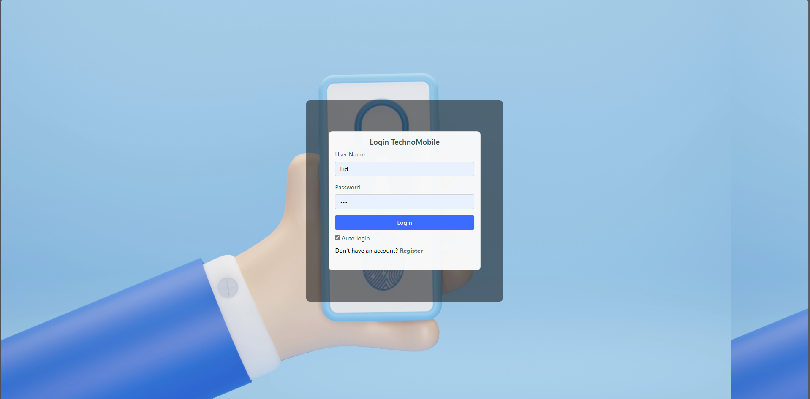
The login interface for users to access their accounts securely.

### Register Page
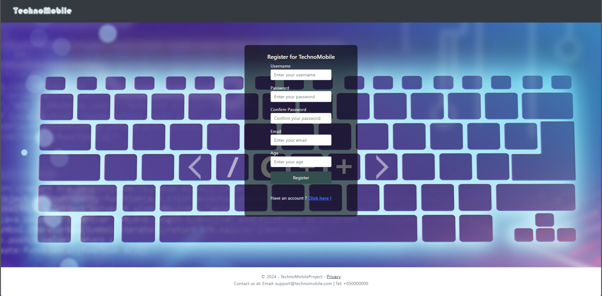
A registration form for new customers with field validation and password comparison.

### Add Admin Page

A form for adding new administrators with username validation and automatic role assignment.

### Admin Home Page

Admin dashboard with navigation links for managing items, sending emails, searching customers, and viewing reports.

### Buy Page
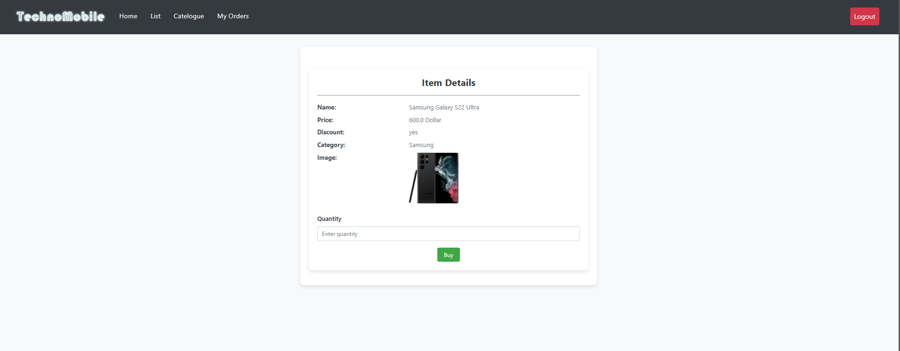
Displays item details with quantity input and calculates the total price based on the quantity.

### Cart Buy

Shopping cart view listing selected items, showing quantities and total prices, with an option to proceed with the purchase.

### Catalogue
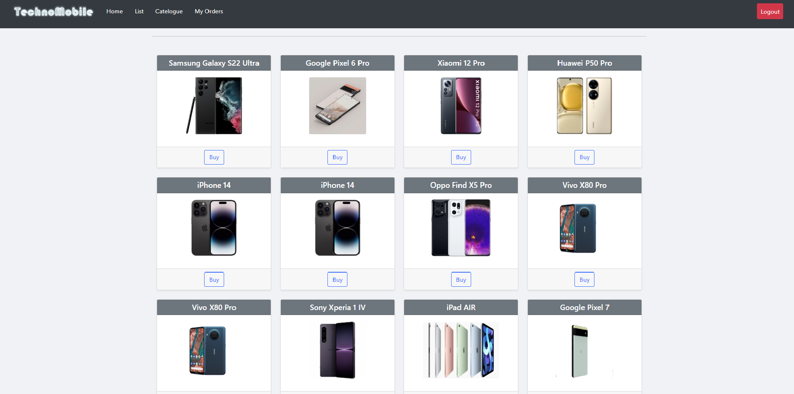
Grid/list view of available items with clickable item names linking to detailed pages.

### Dashboard Page
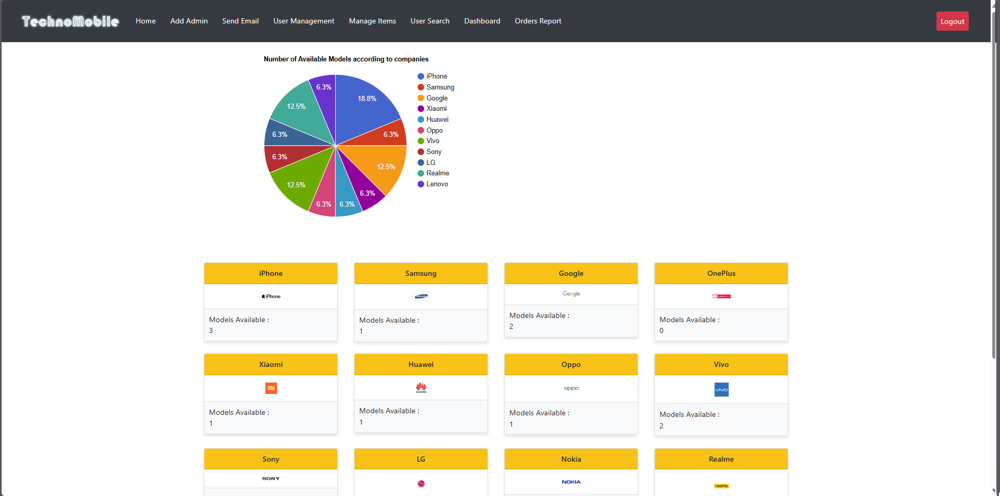
A visual dashboard with a pie chart of item categories and summary cards for total items and order quantities.

### Detail Items

Detailed view of individual items used in modal views for item management.

### Homepage Customer
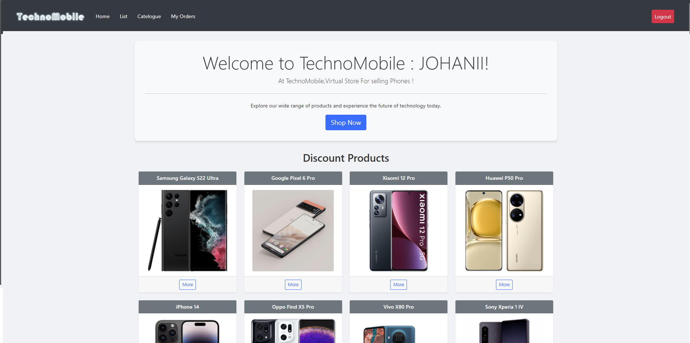
Customer-specific homepage displaying discounted items and a navigation bar.

### Item List
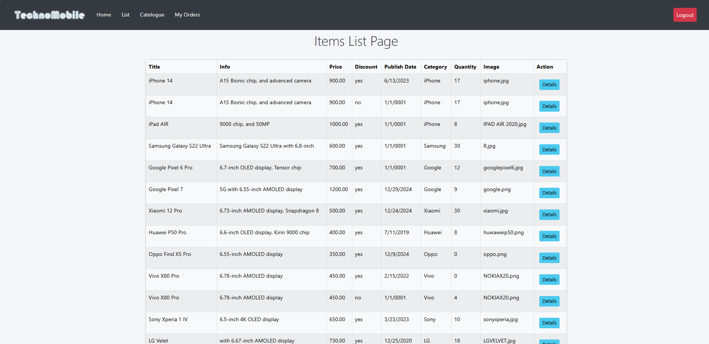
A categorized table of items with full management controls for admins and a limited view for customers.

### Manage Items Page

A comprehensive management interface for CRUD operations on items, including image uploads and modal effects.

### Order Details More
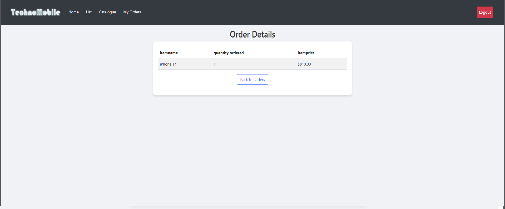
Detailed view of individual order lines showing quantities and prices.

### Order Details Page
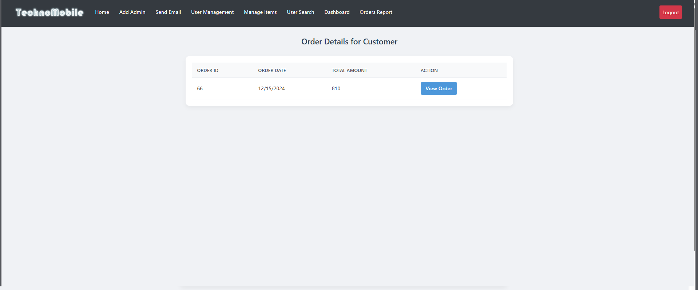
An overview of customer orders with a history of order details.

### Order Report Page

Summary of customers' total purchase amounts with detailed links per customer.

### Place Order
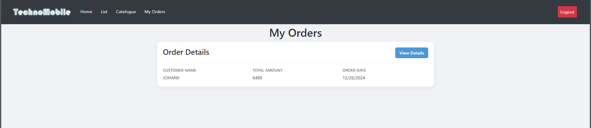
Final order confirmation page with order summary and submission functionality.

### Send Email Page

Interface for composing and sending emails to customers.

### User Search Page
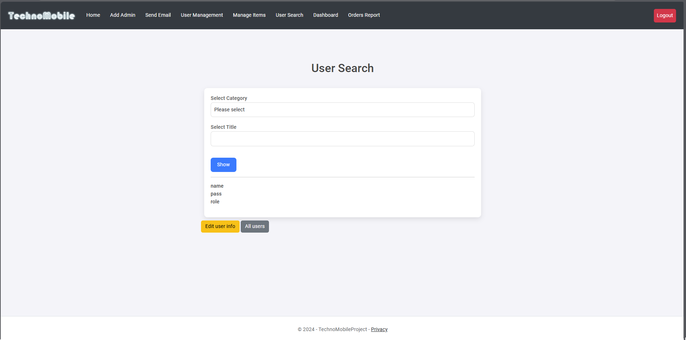
Role-based user search interface with cascading dropdowns and detailed user information.
